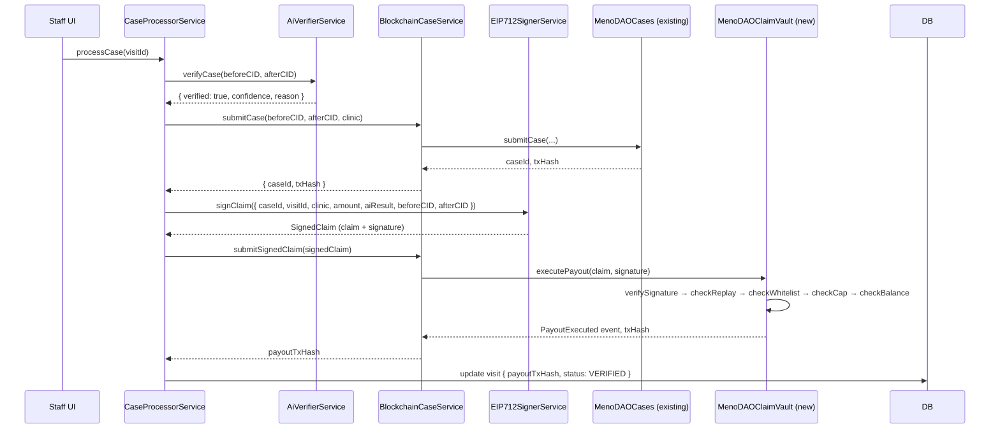

# Design Document: EIP-712 Signed Payouts

## Overview

This feature replaces the direct `approveAndPay` call on `MenoDAOCases` with a cryptographically verifiable intent model. After AI verification, the backend agent signs a structured EIP-712 typed-data `PayoutClaim`. A new `MenoDAOClaimVault` contract verifies the signature on-chain, enforces payout rules, and executes the transfer. The signer wallet holds no funds — a separate treasury wallet funds the contract.

The result is an auditable, tamper-evident chain: Filecoin CIDs (evidence) → AI verification → EIP-712 signed claim → on-chain payout.

### Key Design Decisions

- **EIP-712 over raw signatures**: Structured typed data prevents signature reuse across different contracts/chains and makes the signed payload human-readable in wallets.
- **Signer ≠ Treasury**: The `AGENT_SIGNER_PRIVATE_KEY` only signs claims; it never holds funds. This limits blast radius if the key is compromised.
- **`claimId` as replay guard**: Derived from `keccak256(caseOnChainId, visitId)` — unique per case, stored on-chain after first use.
- **`resultHash` binds AI output**: The hash of `(verified, confidence, reason)` is embedded in the signed claim, making the AI decision tamper-evident on-chain.
- **Mock mode**: When `AGENT_SIGNER_PRIVATE_KEY` or `CLAIM_VAULT_CONTRACT_ADDRESS` are absent, services log warnings and return mock values — consistent with the existing pattern in `BlockchainCaseService`.

> **Note:** Despite the original naming, this contract is NOT an ERC-4337 Paymaster. It does not sponsor gas fees. It is a Claim Vault — it holds payout funds (tFIL) sent by the Treasury, verifies EIP-712 signed claims from the Agent Signer, enforces rules, and releases funds to clinics. Gas for the `executePayout` transaction is paid by the Agent Signer wallet from its own tFIL balance.

### Gas Responsibilities

| Transaction                               | Broadcaster | Gas paid by                       | Notes                       |
| ----------------------------------------- | ----------- | --------------------------------- | --------------------------- |
| Deploy MenoDAOClaimVault                  | Deployer    | `DEPLOYER_PRIVATE_KEY` wallet     | One-time                    |
| `addClinic(address)`                      | Owner       | `DEPLOYER_PRIVATE_KEY` wallet     | Per new clinic              |
| `submitCase(...)` on MenoDAOCases         | Backend     | `BLOCKCHAIN_PRIVATE_KEY` wallet   | Existing, unchanged         |
| `executePayout(...)` on MenoDAOClaimVault | Backend     | `AGENT_SIGNER_PRIVATE_KEY` wallet | New — signer needs gas tFIL |
| Fund contract (send tFIL)                 | Treasury    | Treasury wallet                   | Periodic top-up             |

The Agent Signer wallet must hold a small amount of tFIL for gas (not for payouts). On Filecoin Calibration testnet, use the faucet. On mainnet, budget ~0.0001–0.001 FIL per `executePayout` call.

### Wallet Setup

Three wallets are required:

1. **Deployer/Owner** (`DEPLOYER_PRIVATE_KEY`) — deploys contract, calls `addClinic`, can withdraw. Use a hardware wallet or generate offline. Needs tFIL for deployment gas.

2. **Agent Signer** (`AGENT_SIGNER_PRIVATE_KEY`) — signs EIP-712 claims AND broadcasts `executePayout` transactions. Does NOT hold payout funds. Needs small tFIL for gas. Generate offline:

   ```bash
   node -e "const {ethers}=require('ethers'); const w=ethers.Wallet.createRandom(); console.log('address:',w.address); console.log('privateKey:',w.privateKey); console.log('mnemonic:',w.mnemonic.phrase);"
   ```

   Store mnemonic in cold storage. Add private key to secrets manager (AWS Secrets Manager / GitHub Actions secrets / etc). Add address to env as `AGENT_SIGNER_ADDRESS`.

3. **Treasury** (address only, no private key in backend) — sends tFIL to the ClaimVault contract to fund payouts. Can be a multisig (Gnosis Safe) in production. The contract holds the funds, not this wallet.

> **Hackathon shortcut:** For the demo, `BLOCKCHAIN_PRIVATE_KEY` (existing) and `AGENT_SIGNER_PRIVATE_KEY` can be the same key. In production they MUST be separate.

---

## Architecture



### Component Diagram

```mermaid
graph TD
    subgraph NestJS Backend
        CPS[CaseProcessorService]
        EIP[EIP712SignerService NEW]
        BCS[BlockchainCaseService UPDATED]
        AI[AiVerifierService]
    end

    subgraph Filecoin Calibration chainId=314159
        Cases[MenoDAOCases.sol existing]
        PM[MenoDAOClaimVault.sol NEW]
    end

    subgraph Wallets
        Signer[Agent Signer Wallet - signs only]
        Treasury[Treasury Wallet - funds ClaimVault]
        Deployer[Deployer Wallet - owns ClaimVault]
    end

    CPS --> AI
    CPS --> EIP
    CPS --> BCS
    EIP --> Signer
    BCS --> Cases
    BCS --> PM
    Treasury -->|fund via receive()| PM
    Deployer -->|deploy + addClinic| PM
```

---

## Components and Interfaces

### EIP712SignerService (new)

```typescript
// src/web3/eip712-signer.service.ts

export interface PayoutClaim {
  claimId: string; // bytes32 hex string
  clinic: string; // address
  amount: bigint; // wei
  resultHash: string; // bytes32 hex string
  timestamp: number; // unix seconds
  beforeCID: string;
  afterCID: string;
}

export interface SignedClaim {
  claim: PayoutClaim;
  signature: string; // 65-byte ECDSA sig, 0x-prefixed hex
}

export interface SignClaimInput {
  caseOnChainId: number;
  visitId: string;
  clinicAddress: string;
  amountWei: bigint;
  aiResult: { verified: boolean; confidence: number; reason: string };
  beforeCID: string;
  afterCID: string;
}

@Injectable()
export class EIP712SignerService {
  signClaim(input: SignClaimInput): Promise<SignedClaim>;
  computeResultHash(aiResult: {
    verified: boolean;
    confidence: number;
    reason: string;
  }): string;
  computeClaimId(caseOnChainId: number, visitId: string): string;
}
```

**EIP-712 Domain:**

```typescript
{
  name: 'MenoDAOClaimVault',
  version: '1',
  chainId: 314159,  // Filecoin Calibration
  verifyingContract: CLAIM_VAULT_CONTRACT_ADDRESS,
}
```

**EIP-712 Types:**

```typescript
const types = {
  PayoutClaim: [
    { name: 'claimId', type: 'bytes32' },
    { name: 'clinic', type: 'address' },
    { name: 'amount', type: 'uint256' },
    { name: 'resultHash', type: 'bytes32' },
    { name: 'timestamp', type: 'uint256' },
    { name: 'beforeCID', type: 'string' },
    { name: 'afterCID', type: 'string' },
  ],
};
```

### BlockchainCaseService (updated)

New method added alongside existing `submitCase` and `approveAndPay`:

```typescript
// New method — calls MenoDAOClaimVault.executePayout
async submitSignedClaim(signedClaim: SignedClaim): Promise<string>; // returns payoutTxHash
```

New ABI fragment for ClaimVault:

```typescript
const CLAIM_VAULT_ABI = [
  'function executePayout((bytes32 claimId, address clinic, uint256 amount, bytes32 resultHash, uint256 timestamp, string beforeCID, string afterCID) claim, bytes signature) external',
  'event ClaimValidated(bytes32 indexed claimId, bytes32 resultHash)',
  'event PayoutExecuted(bytes32 indexed claimId, address indexed recipient, uint256 amount)',
];
```

### CaseProcessorService (updated)

In `runPipelineInBackground`, Step 3 changes from:

```typescript
// OLD
const payoutTxHash = await this.blockchainCase.approveAndPay(caseId);
```

to:

```typescript
// NEW
const signedClaim = await this.eip712Signer.signClaim({
  caseOnChainId: caseId,
  visitId,
  clinicAddress,
  amountWei: this.blockchainCase.getPayoutWei(),
  aiResult,
  beforeCID: visit.beforeCID,
  afterCID: visit.afterCID,
});
const payoutTxHash = await this.blockchainCase.submitSignedClaim(signedClaim);
```

### MenoDAOClaimVault.sol (new contract)

```solidity
// contracts/src/MenoDAOClaimVault.sol

function executePayout(PayoutClaim calldata claim, bytes calldata signature) external;
function addClinic(address clinic) external onlyOwner;
function removeClinic(address clinic) external onlyOwner;
function getClaim(bytes32 claimId) external view returns (StoredClaim memory);
function withdraw() external onlyOwner;
receive() external payable;
```

### Deploy Script

```
contracts/scripts/deploy-claim-vault.js
```

Reads `AGENT_SIGNER_ADDRESS` and `DEPLOYER_PRIVATE_KEY` from env, deploys `MenoDAOClaimVault`, writes address to `contracts/.env.claimvault`.

---

## Data Models

### Solidity Structs

```solidity
struct PayoutClaim {
    bytes32 claimId;      // keccak256(abi.encode(caseOnChainId, visitId))
    address clinic;       // recipient of payout
    uint256 amount;       // wei
    bytes32 resultHash;   // keccak256(abi.encode(verified, confidence_1e18, reason))
    uint256 timestamp;    // unix seconds at signing time
    string  beforeCID;    // Filecoin CID of before-treatment image
    string  afterCID;     // Filecoin CID of after-treatment image
}

struct StoredClaim {
    bytes32 claimId;
    address clinic;
    uint256 amount;
    bytes32 resultHash;
    uint256 timestamp;
    string  beforeCID;
    string  afterCID;
    bool    processed;
}
```

### EIP-712 Type Hash

```
PAYOUT_CLAIM_TYPEHASH = keccak256(
  "PayoutClaim(bytes32 claimId,address clinic,uint256 amount,bytes32 resultHash,uint256 timestamp,string beforeCID,string afterCID)"
)
```

### resultHash Encoding

```typescript
// TypeScript (ethers.js v6)
const resultHash = ethers.keccak256(
  ethers.AbiCoder.defaultAbiCoder().encode(
    ['bool', 'uint256', 'string'],
    [
      aiResult.verified,
      BigInt(Math.round(aiResult.confidence * 1e18)),
      aiResult.reason,
    ],
  ),
);
```

```solidity
// Solidity (for off-chain verification reference)
bytes32 resultHash = keccak256(abi.encode(verified, confidence_1e18, reason));
```

### claimId Derivation

```typescript
// TypeScript
const claimId = ethers.keccak256(
  ethers.AbiCoder.defaultAbiCoder().encode(
    ['uint256', 'string'],
    [caseOnChainId, visitId],
  ),
);
```

### Environment Variables

| Variable                       | Used By                                        | Description                                  |
| ------------------------------ | ---------------------------------------------- | -------------------------------------------- |
| `AGENT_SIGNER_PRIVATE_KEY`     | `EIP712SignerService`, `BlockchainCaseService` | Signs EIP-712 claims. Does NOT hold funds.   |
| `CLAIM_VAULT_CONTRACT_ADDRESS` | `BlockchainCaseService`                        | Deployed `MenoDAOClaimVault` address.        |
| `AGENT_SIGNER_ADDRESS`         | Deploy script                                  | Passed to `MenoDAOClaimVault` constructor.   |
| `DEPLOYER_PRIVATE_KEY`         | Deploy script, Hardhat                         | Contract owner / treasury controller.        |
| `MENODAO_CONTRACT_ADDRESS`     | `BlockchainCaseService`                        | Existing `MenoDAOCases` address (unchanged). |
| `CALIBRATION_RPC`              | Both services                                  | RPC endpoint (default: glif.io).             |

### Mock Mode

When `AGENT_SIGNER_PRIVATE_KEY` or `CLAIM_VAULT_CONTRACT_ADDRESS` are not set:

- `EIP712SignerService.signClaim()` logs `[MOCK]` and returns a deterministic fake signature (`0x` + 130 zeros).
- `BlockchainCaseService.submitSignedClaim()` logs `[MOCK]` and returns a fake tx hash.
- The pipeline continues normally — `payoutTxHash` is persisted as the mock value.

This mirrors the existing mock behavior in `BlockchainCaseService.approveAndPay()`.

---

## Correctness Properties

_A property is a characteristic or behavior that should hold true across all valid executions of a system — essentially, a formal statement about what the system should do. Properties serve as the bridge between human-readable specifications and machine-verifiable correctness guarantees._

### Property 1: resultHash is deterministic

_For any_ AI verification result `(verified, confidence, reason)`, calling `computeResultHash` twice with the same inputs SHALL return the identical `bytes32` value.

**Validates: Requirements 1.3**

### Property 2: claimId uniqueness and determinism

_For any_ pair `(caseOnChainId, visitId)`, `computeClaimId` SHALL return the same value on repeated calls. _For any_ two distinct pairs, the resulting claimIds SHALL differ.

**Validates: Requirements 1.4**

### Property 3: Signature round-trip recovers signer

_For any_ valid `PayoutClaim`, signing it with `EIP712SignerService` and then recovering the signer address from the signature using the same EIP-712 domain SHALL return the `Agent_Signer` address.

**Validates: Requirements 1.6, 1.7**

### Property 4: Invalid signer is rejected

_For any_ `PayoutClaim` signed by a wallet that is NOT the configured `agentSigner`, calling `MenoDAOClaimVault.executePayout` SHALL revert with `"Invalid signer"`.

**Validates: Requirements 2.1**

### Property 5: Replay protection

_For any_ valid signed claim, calling `executePayout` a second time with the same claim SHALL revert with `"Claim already processed"`.

> **Edge case:** If a case pipeline fails after `submitCase` but before `executePayout`, and the pipeline is retried, the same `claimId` will be generated. The contract will revert with `"Claim already processed"` on the retry. The `CaseProcessorService` should detect this revert reason and treat it as a success (the claim was already paid) rather than setting status to `REJECTED`.

**Validates: Requirements 2.2**

### Property 6: Clinic whitelist enforcement

_For any_ valid signed claim where the `clinic` address has not been added via `addClinic`, calling `executePayout` SHALL revert with `"Clinic not whitelisted"`.

**Validates: Requirements 2.3**

### Property 7: Max payout cap enforcement

_For any_ signed claim where `amount > 0.01 ether`, calling `executePayout` SHALL revert with `"Amount exceeds max payout"`.

**Validates: Requirements 2.4**

### Property 8: Correct transfer and events on valid claim

_For any_ valid signed claim (correct signer, non-replayed claimId, whitelisted clinic, amount ≤ 0.01 ether, sufficient contract balance), calling `executePayout` SHALL increase the clinic's balance by exactly `claim.amount`, emit `ClaimValidated(claimId, resultHash)`, and emit `PayoutExecuted(claimId, clinic, amount)`.

**Validates: Requirements 2.5, 2.6, 2.7**

### Property 9: Insufficient balance reverts

_For any_ valid signed claim where `claim.amount > address(claimVault).balance`, calling `executePayout` SHALL revert with `"Insufficient contract balance"`.

**Validates: Requirements 2.11**

### Property 10: getClaim round-trip preserves CIDs

_For any_ successfully executed claim containing `beforeCID` and `afterCID`, calling `getClaim(claimId)` SHALL return a `StoredClaim` where `beforeCID` and `afterCID` match the original claim values.

**Validates: Requirements 5.3**

### Property 11: Withdraw restricted to owner

_For any_ address that is not the contract owner, calling `withdraw()` SHALL revert.

**Validates: Requirements 4.3**

---

## Error Handling

### EIP712SignerService

| Condition                            | Behavior                                                     |
| ------------------------------------ | ------------------------------------------------------------ |
| `AGENT_SIGNER_PRIVATE_KEY` not set   | Mock mode: return fake SignedClaim, log `[MOCK]`             |
| `PAYMASTER_CONTRACT_ADDRESS` not set | Mock mode: return fake SignedClaim, log `[MOCK]`             |
| Invalid private key format           | Throw during `init()`, log error, service stays in mock mode |
| `signTypedData` throws               | Propagate error to `CaseProcessorService`                    |

### BlockchainCaseService.submitSignedClaim

| Condition                            | Behavior                          |
| ------------------------------------ | --------------------------------- |
| Contract not initialized (mock mode) | Return mock tx hash, log `[MOCK]` |
| `executePayout` reverts on-chain     | Throw error with revert reason    |
| RPC timeout / network error          | Throw error                       |

### CaseProcessorService (pipeline)

| Condition                                                | Behavior                                                                                                                               |
| -------------------------------------------------------- | -------------------------------------------------------------------------------------------------------------------------------------- |
| `signClaim` throws                                       | Catch in `runPipelineInBackground`, set `web3VerificationStatus = REJECTED`                                                            |
| `submitSignedClaim` throws                               | Catch in `runPipelineInBackground`, set `web3VerificationStatus = REJECTED`                                                            |
| `executePayout` reverts with known reason                | Log specific revert reason before setting REJECTED                                                                                     |
| `executePayout` reverts with `"Claim already processed"` | Treat as success — the claim was already paid on a prior attempt; set `web3VerificationStatus = VERIFIED` and skip re-setting REJECTED |

### MenoDAOClaimVault (contract)

| Condition                                       | Revert Message                         |
| ----------------------------------------------- | -------------------------------------- |
| Recovered signer ≠ agentSigner                  | `"Invalid signer"`                     |
| claimId already processed                       | `"Claim already processed"`            |
| Clinic not whitelisted                          | `"Clinic not whitelisted"`             |
| Amount > MAX_PAYOUT (0.01 ether)                | `"Amount exceeds max payout"`          |
| Contract balance < amount                       | `"Insufficient contract balance"`      |
| Transfer to clinic fails                        | `"Transfer failed"`                    |
| Non-owner calls addClinic/removeClinic/withdraw | `"Not owner"` (via onlyOwner modifier) |

---

## Testing Strategy

### Unit Tests (Jest)

- `EIP712SignerService`:
  - `computeResultHash` returns consistent bytes32 for same input
  - `computeClaimId` returns consistent bytes32 for same input, different for different inputs
  - `signClaim` returns a 65-byte signature (132 hex chars + `0x`)
  - Recovered address from signature matches the signer wallet
  - Mock mode returns fake SignedClaim when env vars absent

- `BlockchainCaseService`:
  - `submitSignedClaim` calls `executePayout` with correct arguments
  - Mock mode returns fake tx hash when contract not initialized

- `CaseProcessorService`:
  - `approveAndPay` is never called after the feature is deployed
  - `signClaim` is called after AI verification succeeds and case is submitted
  - `payoutTxHash` is persisted on success
  - `web3VerificationStatus` is set to `REJECTED` on `submitSignedClaim` failure
  - `web3VerificationStatus` is set to `VERIFIED` (not `REJECTED`) when `executePayout` reverts with `"Claim already processed"`

### Property-Based Tests (fast-check)

Use [fast-check](https://github.com/dubzzz/fast-check) for TypeScript property tests.

Each property test runs a minimum of **100 iterations**.

Tag format: `// Feature: eip712-signed-payouts, Property {N}: {property_text}`

- **Property 1** — `fc.record({ verified: fc.boolean(), confidence: fc.float({ min: 0, max: 1 }), reason: fc.string() })` → assert `computeResultHash` is deterministic
- **Property 2** — `fc.tuple(fc.nat(), fc.string())` → assert `computeClaimId` is deterministic; `fc.uniqueArray(fc.tuple(fc.nat(), fc.string()), { minLength: 2 })` → assert distinct inputs produce distinct claimIds
- **Property 3** — `fc.record({ ... })` generating valid PayoutClaim fields → sign → recover → assert recovered === signerAddress
- **Properties 4–11** — Hardhat/ethers.js contract tests using `@nomicfoundation/hardhat-chai-matchers`; generate random claim parameters to exercise each invariant

### Contract Tests (Hardhat + Chai)

- Deploy `MenoDAOPaymaster` in a local Hardhat network
- Test all revert conditions with concrete examples
- Test event emissions with `expect(...).to.emit(...).withArgs(...)`
- Test balance changes with `expect(...).to.changeEtherBalance(...)`
- Test `getClaim` round-trip after successful `executePayout`

### Integration Tests

- End-to-end pipeline test with mocked AI verifier and mocked Filecoin upload
- Verify `approveAndPay` is never invoked on `MenoDAOCases`
- Verify `submitSignedClaim` is invoked with a correctly structured `SignedClaim`
