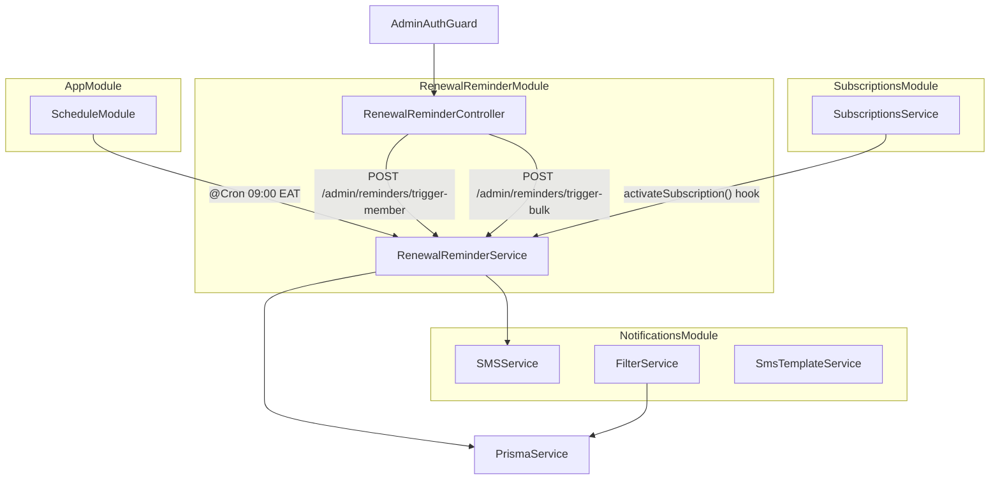

# Design Document: Subscription Renewal Reminders

## Overview

This feature adds automated and admin-triggered SMS reminders for expiring MenoDAO subscriptions, a post-renewal clinic notification, and extended filter dimensions (tier, sub-county) for the admin promotional SMS tool.

The implementation spans three layers:

- **Backend (NestJS)**: A new `RenewalReminderModule` with a cron-driven service, two admin endpoints, schema additions, and extensions to `FilterService` and `SMSService`.
- **Database (Prisma/PostgreSQL)**: New `SmsReminderLog` model, `subCounty`/`county` fields on `Member`.
- **Admin Frontend (Next.js 14)**: New `NotificationPanel` component and extended `SendNotification` filters.

Key design constraints:

- Subscription expiry is **computed** (`startDate + 30d` / `startDate + 365d`) — no stored `expiryDate`.
- Idempotency is enforced via `SmsReminderLog` — running the cron job multiple times per day is safe.
- `@nestjs/schedule` must be added as a dependency and `ScheduleModule.forRoot()` registered in `AppModule`.

---

## Architecture



### Module Structure

```
src/
  renewal-reminders/
    renewal-reminder.module.ts
    renewal-reminder.service.ts
    renewal-reminder.controller.ts
    dto/
      trigger-member.dto.ts
      trigger-bulk.dto.ts
      trigger-bulk-response.dto.ts
```

`RenewalReminderModule` imports `NotificationsModule` (for `SMSService`) and `PrismaModule`. It does **not** import `SubscriptionsModule` — instead, `SubscriptionsService` receives `RenewalReminderService` via constructor injection (circular dependency avoided by `SubscriptionsModule` importing `RenewalReminderModule`).

---

## Components and Interfaces

### RenewalReminderService

```typescript
class RenewalReminderService {
  // Pure expiry computation — no side effects
  computeExpiryDate(startDate: Date, frequency: PaymentFrequency): Date;

  // Cron job — runs daily at 09:00 EAT
  handleDailyReminderCron(): Promise<void>;

  // Core reminder dispatch (used by cron and admin endpoints)
  sendRenewalReminder(
    memberId: string,
    templateKey: ReminderTemplateKey,
  ): Promise<SmsReminderLog>;

  // Post-renewal hook — called by SubscriptionsService.activateSubscription()
  sendPostRenewalNotification(memberId: string): Promise<void>;

  // Admin endpoints
  triggerMemberReminder(memberId: string): Promise<TriggerMemberResult>;
  triggerBulkReminder(daysUntilExpiry: number): Promise<TriggerBulkResult>;

  // Internal helpers
  private isAlreadySentToday(
    memberId: string,
    templateKey: string,
  ): Promise<boolean>;
  private selectTemplateForDaysRemaining(
    daysRemaining: number,
  ): ReminderTemplateKey;
  private getApprovedClinicsForSubCounty(
    subCounty: string | null,
  ): Promise<ClinicSummary[]>;
}
```

### RenewalReminderController

```typescript
@Controller('admin/reminders')
@UseGuards(AdminAuthGuard)
class RenewalReminderController {
  @Post('trigger-member')
  triggerMember(@Body() dto: TriggerMemberDto): Promise<TriggerMemberResult>

  @Post('trigger-bulk')
  triggerBulk(@Body() dto: TriggerBulkDto): Promise<TriggerBulkResult>
}
```

### DTOs

```typescript
// trigger-member.dto.ts
class TriggerMemberDto {
  @IsString()
  @IsNotEmpty()
  memberId: string;
}

// trigger-bulk.dto.ts
class TriggerBulkDto {
  @IsInt()
  @Min(1)
  @Max(30)
  daysUntilExpiry: number;
}

// trigger-bulk-response.dto.ts
interface TriggerBulkResult {
  triggered: number;
  skipped: number; // idempotency skips
  failed: number;
}
```

### FilterService Extensions

Two new optional fields added to `RecipientFilters`:

```typescript
class RecipientFilters {
  // ... existing fields ...
  subCounty?: string; // case-insensitive match
  tier?: PackageTier | 'ALL'; // subscription tier filter
}
```

`buildWhereClause` gains two new condition branches:

```typescript
// subCounty filter
if (filters.subCounty) {
  conditions.push({
    subCounty: { equals: filters.subCounty, mode: 'insensitive' },
  });
}

// tier filter (ALL means no restriction)
if (filters.tier && filters.tier !== 'ALL') {
  conditions.push({
    subscription: { tier: filters.tier as PackageTier },
  });
}
```

### SMS Template Extensions

Three new keys added to `SmsTemplateKey` and `SMS_TEMPLATES`:

| Key                                | Variables                                |
| ---------------------------------- | ---------------------------------------- |
| `subscription_renewal_7day`        | `{{name}}`, `{{expiryDate}}`, `{{tier}}` |
| `subscription_renewal_1day`        | `{{name}}`, `{{expiryDate}}`, `{{tier}}` |
| `subscription_active_with_clinics` | `{{name}}`, `{{tier}}`, `{{clinicList}}` |

English/Swahili variants for all three. When `{{clinicList}}` is empty, the template renders a fallback phrase.

### SubscriptionsService Hook

In `activateSubscription()`, after the subscription update and before NFT minting:

```typescript
// Call post-renewal notification (non-blocking)
try {
  await this.renewalReminderService.sendPostRenewalNotification(memberId);
} catch (error) {
  this.logger.error('Post-renewal notification failed:', error);
  // Non-blocking — subscription activation continues
}
```

---

## Data Models

### SmsReminderLog (new)

```prisma
model SmsReminderLog {
  id                String             @id @default(uuid())
  memberId          String
  phoneNumber       String
  templateKey       String
  sentAt            DateTime           @default(now())
  deliveryStatus    ReminderLogStatus
  providerMessageId String?

  @@index([memberId, templateKey, sentAt])
  @@index([sentAt])
}

enum ReminderLogStatus {
  SENT
  FAILED
}
```

No foreign key to `Member` — log records are retained even if the member is deleted (Requirement 7.4).

### Member model additions

```prisma
model Member {
  // ... existing fields ...
  subCounty  String?
  county     String?

  // ... existing relations ...

  @@index([subCounty])   // new index
}
```

### Migration

A single migration file handles both changes:

- `ALTER TABLE "Member" ADD COLUMN "subCounty" TEXT, ADD COLUMN "county" TEXT`
- `CREATE INDEX "Member_subCounty_idx" ON "Member"("subCounty")`
- `CREATE TABLE "SmsReminderLog" (...)`
- `CREATE INDEX` statements for `SmsReminderLog`

---

## Correctness Properties

_A property is a characteristic or behavior that should hold true across all valid executions of a system — essentially, a formal statement about what the system should do. Properties serve as the bridge between human-readable specifications and machine-verifiable correctness guarantees._

Property-based testing is appropriate here because `computeExpiryDate`, the subscription window filter, the idempotency check, the clinic list builder, and the filter intersection logic are all pure or near-pure functions whose correctness must hold across a wide input space.

The chosen PBT library is **`fast-check`** (TypeScript-native, works with Jest).

---

### Property 1: Expiry date is always after start date

_For any_ valid `startDate` and either `PaymentFrequency` value, `computeExpiryDate(startDate, frequency)` SHALL return a date strictly greater than `startDate`.

**Validates: Requirements 1.4**

---

### Property 2: Expiry date offset matches payment frequency

_For any_ valid `startDate`, `computeExpiryDate(startDate, MONTHLY)` SHALL return `startDate + 30 days` and `computeExpiryDate(startDate, ANNUAL)` SHALL return `startDate + 365 days`.

**Validates: Requirements 1.1, 1.2**

---

### Property 3: Subscription window filter correctness

_For any_ set of active subscriptions with arbitrary `startDate` and `paymentFrequency` values, the function that selects subscriptions expiring within a given day window SHALL return exactly those subscriptions whose computed expiry date falls within that window — no more, no fewer.

**Validates: Requirements 2.2, 2.3, 8.3, 8.4**

---

### Property 4: Idempotency — running the job twice produces the same log count

_For any_ set of eligible members on a given reference date, executing the reminder dispatch logic twice SHALL produce the same number of `SmsReminderLog` records as executing it once (i.e., the second run creates zero new records for already-sent members).

**Validates: Requirements 3.1, 3.2, 3.3, 8.7**

---

### Property 5: Clinic list is bounded and filtered

_For any_ sub-county value and any set of clinics (with arbitrary statuses and sub-counties), the clinic list returned for a post-renewal notification SHALL contain only clinics with `status = APPROVED` and `subCounty` matching the member's sub-county, and SHALL contain at most 5 entries.

**Validates: Requirements 4.2, 4.3, 4.4, 4.5**

---

### Property 6: Template rendering contains all variable values

_For any_ new reminder template key, language (`en` or `sw`), and complete set of variable values, `SmsTemplateService.render(key, lang, vars)` SHALL return a string that contains each variable's value as a substring.

**Validates: Requirements 6.1, 6.2, 6.3, 6.6**

---

### Property 7: Template selection maps days-remaining to correct key

_For any_ integer `daysRemaining`, `selectTemplateForDaysRemaining(daysRemaining)` SHALL return `subscription_renewal_1day` when `daysRemaining <= 1`, and `subscription_renewal_7day` for all other values.

**Validates: Requirements 8.1, 8.2**

---

### Property 8: Combined filter is a subset of each individual filter

_For any_ member dataset, any `tier` value, and any `subCounty` value, the recipient set produced by `FilterService` with both `tier` and `subCounty` set SHALL be a subset of the recipient set produced with only `tier` set, and also a subset of the recipient set produced with only `subCounty` set.

**Validates: Requirements 9.1, 9.2, 9.3, 9.8**

---

## Error Handling

| Scenario                                                     | Behaviour                                                                                              |
| ------------------------------------------------------------ | ------------------------------------------------------------------------------------------------------ |
| `SMSService` throws / returns failure for one member         | Log `FAILED` in `SmsReminderLog`, continue to next member. Never abort the cron run.                   |
| `sendPostRenewalNotification` throws                         | Catch in `activateSubscription`, log at ERROR, do not re-throw. Subscription activation is unaffected. |
| `trigger-member` called with unknown `memberId`              | Return HTTP 404 with `{ message: "No active subscription found for member" }`.                         |
| `trigger-bulk` called with `daysUntilExpiry` outside 1–30    | Return HTTP 400 with descriptive validation error (handled by class-validator).                        |
| Member has null `subCounty` during post-renewal notification | Send SMS without clinic list, log WARNING with `memberId`.                                             |
| No approved clinics in member's sub-county                   | Send SMS with fallback phrase in `{{clinicList}}` slot.                                                |
| Prisma query fails during cron run                           | Log at ERROR, abort the current cron run, do not crash the process.                                    |

---

## Testing Strategy

### Unit Tests (Jest)

- `computeExpiryDate` — example-based tests for MONTHLY and ANNUAL with known dates.
- `selectTemplateForDaysRemaining` — boundary values: 0, 1, 2, 7, 8.
- `isAlreadySentToday` — mock Prisma, test found/not-found cases.
- `getApprovedClinicsForSubCounty` — mock Prisma, test 0, 3, 5, 7 clinic cases.
- `triggerMemberReminder` — mock service, verify 404 path and success path.
- `triggerBulkReminder` — mock service, verify response shape.
- `FilterService.buildWhereClause` — test new `subCounty` and `tier` branches.
- `SmsTemplateService.render` — test new template keys with known variable sets.

### Property-Based Tests (fast-check + Jest)

Each property test runs a minimum of **100 iterations**.

| Test                                   | Property   | Tag                                                   |
| -------------------------------------- | ---------- | ----------------------------------------------------- |
| `computeExpiryDate` always after start | Property 1 | `Feature: subscription-renewal-reminders, Property 1` |
| `computeExpiryDate` correct offset     | Property 2 | `Feature: subscription-renewal-reminders, Property 2` |
| Subscription window filter             | Property 3 | `Feature: subscription-renewal-reminders, Property 3` |
| Idempotency                            | Property 4 | `Feature: subscription-renewal-reminders, Property 4` |
| Clinic list bounded and filtered       | Property 5 | `Feature: subscription-renewal-reminders, Property 5` |
| Template rendering completeness        | Property 6 | `Feature: subscription-renewal-reminders, Property 6` |
| Template selection mapping             | Property 7 | `Feature: subscription-renewal-reminders, Property 7` |
| Combined filter subset                 | Property 8 | `Feature: subscription-renewal-reminders, Property 8` |

### Integration Tests

- Cron decorator is configured with correct expression (`0 9 * * *` in EAT / `0 6 * * *` UTC).
- `AdminAuthGuard` is applied to both controller endpoints.
- `SmsReminderLog` records are persisted to the database after a full cron run (using a test database).

### Frontend Tests (Jest + React Testing Library)

- `NotificationPanel` renders member ID input, bulk days input, and submit buttons.
- Submitting valid member ID calls `POST /admin/reminders/trigger-member` and shows success state.
- Submitting bulk form calls `POST /admin/reminders/trigger-bulk` and shows count.
- API error displays error message and re-enables buttons.
- `SendNotification` renders sub-county text input and tier selector.
- Changing tier/sub-county triggers debounced preview update.

---

## Frontend Changes

### NotificationPanel Component

New file: `menodao-frontend/src/app/admin/components/NotificationPanel.tsx`

```
┌─────────────────────────────────────────────┐
│  Renewal Reminders                          │
│                                             │
│  Single Member                              │
│  Member ID: [________________] [Send]       │
│  ✓ Sent subscription_renewal_7day to +254…  │
│                                             │
│  Bulk Reminder                              │
│  Days Until Expiry: [7] [Send to All]       │
│  ✓ Notified 12 members                      │
└─────────────────────────────────────────────┘
```

Placed on the admin notifications page alongside `SendNotification` and `NotificationHistory`.

### SendNotification Filter Extensions

Two new fields added to the Recipient Filters section of `SendNotification.tsx`:

- **Sub-County** — `<input type="text" placeholder="e.g. Westlands" />` — maps to `subCounty` in the API payload.
- **Tier** — `<select>` with options `All | Bronze | Silver | Gold` — maps to `tier` in the API payload (`ALL` when "All" is selected, omitted or sent as `ALL`).

Both fields participate in the existing debounced `previewRecipients` call. The `adminApi` types are extended to include `subCounty?: string` and `tier?: string` in the filters object.
