# Design Document: WhatsApp AI Chatbot (MenoAI)

## Overview

MenoAI is a WhatsApp-based AI chatbot that gives MenoDAO members a conversational interface to their dental insurance account. It integrates with the Meta WhatsApp Cloud API for messaging, OpenAI GPT-4o for dental AI assistance and intent classification, and the existing NestJS backend services for all business logic. Members can manage subscriptions, find clinics, check claims, get dental health guidance, view visit history, track referrals, and explore blockchain impact proofs — all without opening a browser.

The chatbot is implemented as a new NestJS module (`src/whatsapp/`) that plugs into the existing `AppModule`. It is stateful (Redis-backed sessions), bilingual (English and Swahili), and security-hardened (HMAC-SHA256 webhook signature validation, rate limiting, phone normalisation).

## Architecture

### System Component Diagram

```mermaid
graph TB
    subgraph Meta["Meta WhatsApp Cloud API"]
        WA[WhatsApp Business Platform]
    end

    subgraph NestJS["NestJS Application (menodao-backend)"]
        subgraph WhatsAppModule["src/whatsapp/"]
            CTRL[WhatsAppController\nGET|POST /whatsapp/webhook\nGET /whatsapp/health]
            SIG[WebhookSignatureGuard\nX-Hub-Signature-256]
            WS[WhatsAppService\nMessage Router / Orchestrator]
            SS[SessionService\nRedis-backed state]
            META[MetaApiService\nHTTP client for Cloud API]
            LLM[LlmService\nOpenAI GPT-4o]
            subgraph Flows["flows/"]
                F1[subscription.flow.ts]
                F2[clinic.flow.ts]
                F3[claims.flow.ts]
                F4[dental-ai.flow.ts]
                F5[escalation.flow.ts]
                F6[visit-history.flow.ts]
                F7[referrals.flow.ts]
                F8[blockchain.flow.ts]
                F9[account-settings.flow.ts]
            end
        end

        subgraph ExistingModules["Existing NestJS Modules"]
            MS[MembersService]
            SUBS[SubscriptionsService]
            PAY[PaymentService]
            CLIN[ClinicsService]
            REF[ReferralService]
            WEB3[CaseProcessorService]
            CONTRIB[ContributionsService]
        end

        PRISMA[(PostgreSQL\nvia Prisma)]
    end

    subgraph Infra["Infrastructure"]
        REDIS[(Redis\nSession Store)]
        OPENAI[OpenAI API\nGPT-4o]
    end

    WA -->|POST /whatsapp/webhook| CTRL
    CTRL -->|verify| SIG
    SIG -->|valid| WS
    WS --> SS
    WS --> META
    WS --> LLM
    WS --> Flows
    Flows --> MS
    Flows --> SUBS
    Flows --> PAY
    Flows --> CLIN
    Flows --> REF
    Flows --> WEB3
    Flows --> CONTRIB
    SS <--> REDIS
    LLM <--> OPENAI
    MS --> PRISMA
    SUBS --> PRISMA
    PAY --> PRISMA
    META -->|send messages| WA
```

### Request Lifecycle

1. Meta POSTs an inbound message to `POST /whatsapp/webhook`
2. `WebhookSignatureGuard` validates `X-Hub-Signature-256` using HMAC-SHA256 of the raw body against `WHATSAPP_APP_SECRET`; returns 403 on failure
3. `WhatsAppController` returns HTTP 200 immediately, then fires async processing via `WhatsAppService.handleInbound()`
4. `WhatsAppService` normalises the phone number, loads or creates the session from Redis, deduplicates by message ID
5. `MetaApiService.sendTypingIndicator()` is called for LLM/DB-heavy operations
6. The current `ChatState` determines which flow handler is invoked
7. If the message is free-text and no state-specific handler matches, `LlmService.classifyIntent()` routes to the correct flow
8. The flow calls existing NestJS services, builds a response, and calls `MetaApiService` to send it
9. Session state is updated and persisted back to Redis with a refreshed 30-minute TTL

## Module Structure

```
src/whatsapp/
├── whatsapp.module.ts              # NestJS module definition, imports, providers
├── whatsapp.controller.ts          # HTTP endpoints: GET/POST /whatsapp/webhook, GET /whatsapp/health
├── whatsapp.service.ts             # Main message router and orchestrator
├── session.service.ts              # Redis-backed session CRUD with in-memory fallback
├── meta-api.service.ts             # WhatsApp Cloud API HTTP client
├── llm.service.ts                  # OpenAI GPT-4o integration
├── guards/
│   └── webhook-signature.guard.ts  # X-Hub-Signature-256 HMAC validation
├── flows/
│   ├── subscription.flow.ts        # Req 5: subscription view, new, upgrade, payment polling
│   ├── clinic.flow.ts              # Req 6: clinic finder by location/sub-county
│   ├── claims.flow.ts              # Req 7: claim eligibility check and status
│   ├── dental-ai.flow.ts           # Req 8: LLM dental health assistant
│   ├── escalation.flow.ts          # Req 9: human dentist escalation
│   ├── visit-history.flow.ts       # Req 14: visit history with Hypercert NFT status
│   ├── referrals.flow.ts           # Req 15: champion referral stats and sharing
│   ├── blockchain.flow.ts          # Req 16: blockchain impact proof and NFT info
│   └── account-settings.flow.ts   # Req 10: profile, language, payment history
├── i18n/
│   ├── en.ts                       # English message catalogue (all user-facing strings)
│   └── sw.ts                       # Swahili message catalogue
└── dto/
    └── webhook.dto.ts              # TypeScript types for Meta webhook payload
```

### File Responsibilities

**whatsapp.module.ts** — Declares all providers, imports `MembersModule`, `SubscriptionsModule`, `PaymentsModule`, `ClinicsModule`, `ReferralModule`, `Web3Module`, `ContributionsModule`. Registers `HttpModule` for Meta API calls. Exports nothing (self-contained).

**whatsapp.controller.ts** — Three routes only. Delegates all logic to `WhatsAppService`. Applies `WebhookSignatureGuard` to the POST route only. Returns 200 immediately on POST before async processing.

**whatsapp.service.ts** — Entry point for all inbound messages. Handles: phone normalisation, session load/create, message deduplication, rate limiting, state machine dispatch, unrecognised input counter, "menu"/"back"/"cancel" global commands.

**session.service.ts** — `get(phone)`, `set(phone, session)`, `delete(phone)`. Uses `ioredis` if `REDIS_URL` is set, otherwise falls back to an in-memory `Map`. TTL is always 1800 seconds, refreshed on every `set()`.

**meta-api.service.ts** — Wraps the Meta Graph API. Methods: `sendText()`, `sendButtons()`, `sendList()`, `sendTemplate()`, `sendTypingIndicator()`. Implements retry with exponential backoff (3 attempts, 1s/2s/4s delays). Logs all outbound messages.

**llm.service.ts** — Two public methods: `classifyIntent(message, history)` → `IntentType`, and `dentalChat(message, history, memberContext)` → `string`. Uses `openai` npm package. Enforces 300-word limit on dental responses. Has timeout (15s) and fallback.

**flows/\*.flow.ts** — Each flow is an `@Injectable()` service with a `handle(session, message)` method that returns `void` (sends messages via `MetaApiService`) and mutates the session state. Flows call existing NestJS services directly via constructor injection.

**i18n/en.ts and sw.ts** — Plain TypeScript objects exporting a `Messages` record. All user-facing strings are keyed constants. No string interpolation in the catalogue — functions accept parameters and return formatted strings.

**dto/webhook.dto.ts** — TypeScript interfaces (not classes) for the Meta webhook payload. No class-validator decorators needed since validation is done via HMAC signature.

**guards/webhook-signature.guard.ts** — Implements `CanActivate`. Reads raw body from `req.rawBody` (requires `bodyParser` raw middleware on this route), computes HMAC-SHA256, compares with `timingSafeEqual`. Returns 403 on mismatch.

## Components and Interfaces

### TypeScript Interfaces

```typescript
// dto/webhook.dto.ts

export interface MetaWebhookPayload {
  object: 'whatsapp_business_account';
  entry: MetaEntry[];
}

export interface MetaEntry {
  id: string;
  changes: MetaChange[];
}

export interface MetaChange {
  value: MetaChangeValue;
  field: 'messages';
}

export interface MetaChangeValue {
  messaging_product: 'whatsapp';
  metadata: { display_phone_number: string; phone_number_id: string };
  contacts?: MetaContact[];
  messages?: MetaMessage[];
  statuses?: MetaStatus[];
}

export interface MetaContact {
  profile: { name: string };
  wa_id: string;
}

export interface MetaMessage {
  from: string; // sender phone number (E.164 without +)
  id: string; // unique message ID for deduplication
  timestamp: string;
  type: 'text' | 'interactive' | 'location' | 'image' | 'audio' | 'document';
  text?: { body: string };
  interactive?: {
    type: 'button_reply' | 'list_reply';
    button_reply?: { id: string; title: string };
    list_reply?: { id: string; title: string; description?: string };
  };
  location?: {
    latitude: number;
    longitude: number;
    name?: string;
    address?: string;
  };
}

export interface MetaStatus {
  id: string;
  status: 'sent' | 'delivered' | 'read' | 'failed';
  timestamp: string;
  recipient_id: string;
}
```

### Session and State Interfaces

```typescript
// Defined in session.service.ts and exported

export enum ChatState {
  WELCOME = 'WELCOME',
  MAIN_MENU = 'MAIN_MENU',

  // Subscription flow
  SUBSCRIPTION_VIEW = 'SUBSCRIPTION_VIEW',
  SUBSCRIPTION_SELECT_TIER = 'SUBSCRIPTION_SELECT_TIER',
  SUBSCRIPTION_SELECT_FREQUENCY = 'SUBSCRIPTION_SELECT_FREQUENCY',
  SUBSCRIPTION_AWAITING_PAYMENT = 'SUBSCRIPTION_AWAITING_PAYMENT',

  // Clinic flow
  CLINIC_PROMPT_LOCATION = 'CLINIC_PROMPT_LOCATION',
  CLINIC_RESULTS = 'CLINIC_RESULTS',

  // Claims flow
  CLAIMS_CHECK = 'CLAIMS_CHECK',
  CLAIMS_STATUS = 'CLAIMS_STATUS',

  // Dental AI
  DENTAL_AI_CHAT = 'DENTAL_AI_CHAT',

  // Escalation
  ESCALATION_OPTIONS = 'ESCALATION_OPTIONS',

  // Visit history
  VISIT_HISTORY = 'VISIT_HISTORY',

  // Referrals
  REFERRALS_VIEW = 'REFERRALS_VIEW',

  // Blockchain
  BLOCKCHAIN_VIEW = 'BLOCKCHAIN_VIEW',

  // Account settings
  ACCOUNT_SETTINGS = 'ACCOUNT_SETTINGS',
  ACCOUNT_PROFILE = 'ACCOUNT_PROFILE',
  ACCOUNT_LANGUAGE = 'ACCOUNT_LANGUAGE',
  ACCOUNT_PAYMENT_HISTORY = 'ACCOUNT_PAYMENT_HISTORY',
}

export interface PendingPayment {
  contributionId: string;
  amount: number;
  tier: string; // 'BRONZE' | 'SILVER' | 'GOLD'
  isUpgrade: boolean;
  pollCount: number; // incremented each poll cycle, max 12
  pollIntervalId?: NodeJS.Timeout; // not persisted to Redis
}

export interface ConversationTurn {
  role: 'user' | 'assistant';
  content: string;
}

export interface ChatSession {
  phoneNumber: string; // E.164 format, e.g. +254712345678
  memberId: string | null; // null until phone lookup succeeds
  state: ChatState;
  previousState: ChatState | null;
  language: 'en' | 'sw';
  conversationHistory: ConversationTurn[]; // capped at 10 turns
  pendingPayment: Omit<PendingPayment, 'pollIntervalId'> | null;
  unrecognisedCount: number; // reset to 0 on any recognised input
  lastActivityAt: number; // Unix timestamp ms
  processedMessageIds: string[]; // last 50 message IDs for deduplication
}
```

### Intent Classification Types

```typescript
// llm.service.ts

export type IntentType =
  | 'DENTAL_QUESTION'
  | 'SUBSCRIPTION_QUERY'
  | 'CLINIC_QUERY'
  | 'CLAIM_QUERY'
  | 'ESCALATION_REQUEST'
  | 'VISIT_HISTORY_QUERY'
  | 'REFERRAL_QUERY'
  | 'BLOCKCHAIN_QUERY'
  | 'ACCOUNT_QUERY'
  | 'MENU_NAVIGATION'
  | 'UNRECOGNISED';

export interface MemberContext {
  tier: string | null;
  annualCapLimit: number | null;
  annualCapUsed: number | null;
  isActive: boolean;
}
```

## Data Models

### Session Storage Schema (Redis)

Key: `whatsapp:session:{e164PhoneNumber}`
Value: JSON-serialised `ChatSession` (excluding `pollIntervalId`)
TTL: 1800 seconds, refreshed on every write

```
whatsapp:session:+254712345678 → { "phoneNumber": "+254712345678", "memberId": "clx...", "state": "MAIN_MENU", ... }
```

### Message Deduplication (Redis)

Key: `whatsapp:msgid:{messageId}`
Value: `"1"` (presence check only)
TTL: 86400 seconds (24 hours)

### Rate Limiting (Redis or in-memory)

Key: `whatsapp:ratelimit:{e164PhoneNumber}`
Value: Sorted set of timestamps (sliding window)
TTL: 60 seconds

### No new Prisma models required

The WhatsApp module reads from and writes to existing Prisma models:

- `Member` — phone lookup, `preferredLanguage` update
- `Subscription` — subscription status, tier, cap
- `Contribution` — create pending contribution before STK push, poll status
- `Visit` — visit history via `getMemberHistory()`
- `Claim` — claim history via `getClaimHistory()`
- `BlockchainTransaction` — via `getTransactionHistory()`

Escalation events are logged via NestJS `Logger` (structured JSON) — no new DB table needed for MVP. A future `WhatsAppEscalation` table can be added if analytics require it.

## Conversation State Machine

```mermaid
stateDiagram-v2
    [*] --> WELCOME : first message / session expired

    WELCOME --> MAIN_MENU : any message (after member lookup)
    WELCOME --> MAIN_MENU : member not found → show register prompt

    MAIN_MENU --> SUBSCRIPTION_VIEW : option 1 / "subscription"
    MAIN_MENU --> CLINIC_PROMPT_LOCATION : option 2 / "clinic"
    MAIN_MENU --> CLAIMS_CHECK : option 3 / "claim"
    MAIN_MENU --> DENTAL_AI_CHAT : option 4 / "dental"
    MAIN_MENU --> ESCALATION_OPTIONS : option 5 / "dentist"
    MAIN_MENU --> VISIT_HISTORY : option 6 / "history"
    MAIN_MENU --> REFERRALS_VIEW : option 7 / "referral"
    MAIN_MENU --> BLOCKCHAIN_VIEW : option 8 / "blockchain"
    MAIN_MENU --> ACCOUNT_SETTINGS : option 9 / "account"

    SUBSCRIPTION_VIEW --> SUBSCRIPTION_SELECT_TIER : "subscribe" / "upgrade"
    SUBSCRIPTION_SELECT_TIER --> SUBSCRIPTION_SELECT_FREQUENCY : tier selected
    SUBSCRIPTION_SELECT_FREQUENCY --> SUBSCRIPTION_AWAITING_PAYMENT : frequency selected → STK push
    SUBSCRIPTION_AWAITING_PAYMENT --> MAIN_MENU : payment confirmed
    SUBSCRIPTION_AWAITING_PAYMENT --> SUBSCRIPTION_SELECT_TIER : payment failed / timeout → retry

    CLINIC_PROMPT_LOCATION --> CLINIC_RESULTS : location shared or sub-county typed
    CLINIC_RESULTS --> CLINIC_PROMPT_LOCATION : "search again"

    CLAIMS_CHECK --> CLAIMS_STATUS : eligible member
    CLAIMS_CHECK --> SUBSCRIPTION_VIEW : no subscription
    CLAIMS_CHECK --> CLAIMS_CHECK : in waiting period (show date)

    DENTAL_AI_CHAT --> DENTAL_AI_CHAT : follow-up dental question
    DENTAL_AI_CHAT --> ESCALATION_OPTIONS : LLM recommends dentist / user requests

    ESCALATION_OPTIONS --> MAIN_MENU : escalation initiated

    ACCOUNT_SETTINGS --> ACCOUNT_PROFILE : option a
    ACCOUNT_SETTINGS --> ACCOUNT_LANGUAGE : option b
    ACCOUNT_SETTINGS --> ACCOUNT_PAYMENT_HISTORY : option c
    ACCOUNT_PROFILE --> ACCOUNT_SETTINGS : back
    ACCOUNT_LANGUAGE --> ACCOUNT_SETTINGS : language selected
    ACCOUNT_PAYMENT_HISTORY --> ACCOUNT_SETTINGS : back

    SUBSCRIPTION_VIEW --> MAIN_MENU : back / cancel
    SUBSCRIPTION_SELECT_TIER --> MAIN_MENU : cancel
    SUBSCRIPTION_SELECT_TIER --> SUBSCRIPTION_VIEW : back
    SUBSCRIPTION_SELECT_FREQUENCY --> SUBSCRIPTION_SELECT_TIER : back
    CLINIC_PROMPT_LOCATION --> MAIN_MENU : back / cancel
    CLINIC_RESULTS --> MAIN_MENU : cancel
    CLINIC_RESULTS --> CLINIC_PROMPT_LOCATION : back
    CLAIMS_CHECK --> MAIN_MENU : back / cancel
    CLAIMS_STATUS --> MAIN_MENU : back / cancel
    DENTAL_AI_CHAT --> MAIN_MENU : cancel / "menu"
    ESCALATION_OPTIONS --> MAIN_MENU : back / cancel
    VISIT_HISTORY --> MAIN_MENU : back / cancel
    REFERRALS_VIEW --> MAIN_MENU : back / cancel
    BLOCKCHAIN_VIEW --> MAIN_MENU : back / cancel
    ACCOUNT_SETTINGS --> MAIN_MENU : back / cancel

    note right of MAIN_MENU
      Global commands (any state):
      "menu" / "menyu" / "0" → MAIN_MENU
      "back" / "rudi" → previousState
      "cancel" / "acha" → MAIN_MENU
    end note
```



### Global Command Handling

Before any state-specific handler runs, `WhatsAppService` checks for global commands:

| Input                                 | Action                                                         |
| ------------------------------------- | -------------------------------------------------------------- |
| `menu`, `menyu`, `0`                  | Reset to `MAIN_MENU`, clear `unrecognisedCount`                |
| `back`, `rudi`                        | Transition to `session.previousState` (or `MAIN_MENU` if null) |
| `cancel`, `acha`                      | Transition to `MAIN_MENU`                                      |
| Any 3 consecutive unrecognised inputs | Show `MAIN_MENU` with prompt                                   |

## API Endpoints

### GET /whatsapp/webhook — Hub Verification

Meta calls this endpoint when the webhook is first registered or re-verified.

**Query Parameters:**

| Parameter          | Type   | Description                                |
| ------------------ | ------ | ------------------------------------------ |
| `hub.mode`         | string | Must equal `"subscribe"`                   |
| `hub.verify_token` | string | Must match `WHATSAPP_VERIFY_TOKEN` env var |
| `hub.challenge`    | string | Echo this value back in the response body  |

**Responses:**

- `200 OK` — body is the raw `hub.challenge` string (plain text, not JSON)
- `403 Forbidden` — `hub.mode` is not `"subscribe"` or `hub.verify_token` does not match

**Implementation note:** No guard is applied to this endpoint. Token comparison uses `timingSafeEqual` to prevent timing attacks.

---

### POST /whatsapp/webhook — Inbound Messages

Meta POSTs all inbound message events here.

**Headers:**

| Header                | Required | Description                        |
| --------------------- | -------- | ---------------------------------- |
| `X-Hub-Signature-256` | Yes      | `sha256=<HMAC-SHA256 of raw body>` |
| `Content-Type`        | Yes      | `application/json`                 |

**Body:** `MetaWebhookPayload` (see dto/webhook.dto.ts)

**Guard:** `WebhookSignatureGuard` — validates HMAC before the controller method runs.

**Response:**

- `200 OK` — always returned immediately (empty body `{}`)
- `403 Forbidden` — invalid or missing `X-Hub-Signature-256`

**Processing:** After returning 200, the controller calls `whatsappService.handleInbound(payload)` without `await`. All errors in async processing are caught and logged; they never affect the HTTP response.

**Raw body requirement:** NestJS must be configured to preserve the raw body for HMAC validation. In `main.ts`:

```typescript
// Preserve raw body for HMAC validation on the webhook route
app.use('/whatsapp/webhook', (req: any, res: any, next: any) => {
  express.raw({ type: 'application/json' })(req, res, (err) => {
    if (err) return next(err);
    req.rawBody = req.body;
    req.body = JSON.parse(req.body.toString());
    next();
  });
});
```

---

### GET /whatsapp/health — Health Check

Returns the connectivity status of external dependencies.

**Response body:**

```json
{
  "status": "ok",
  "whatsappApi": { "status": "ok", "latencyMs": 142 },
  "openaiApi": { "status": "ok", "latencyMs": 380 },
  "redis": { "status": "ok" },
  "timestamp": "2025-01-15T10:30:00.000Z"
}
```

**HTTP status:** `200` if all dependencies are `ok`, `503` if any are `error`.

**Implementation:** Sends a lightweight probe to each dependency:

- WhatsApp API: `GET https://graph.facebook.com/v19.0/{PHONE_NUMBER_ID}` with bearer token
- OpenAI API: `GET https://api.openai.com/v1/models` with API key
- Redis: `PING` command (or `"disabled"` if using in-memory fallback)

## WhatsApp Message Type Strategy

### Decision Rules

| Scenario                                                         | Message Type        | Reason                   |
| ---------------------------------------------------------------- | ------------------- | ------------------------ |
| Simple text response, confirmation, error                        | Text                | No interaction needed    |
| Yes/No choice, 2-3 options                                       | Interactive Buttons | ≤3 options per Meta spec |
| Main menu (9 items), package selection (3 tiers × 2 frequencies) | Interactive List    | 4-10 options             |
| Proactive outbound outside 24hr window                           | Template            | Meta policy requirement  |
| Typing indicator before LLM/DB calls                             | Typing indicator    | UX signal                |

### Interactive List Message — Main Menu

```json
{
  "messaging_product": "whatsapp",
  "recipient_type": "individual",
  "to": "+254712345678",
  "type": "interactive",
  "interactive": {
    "type": "list",
    "header": { "type": "text", "text": "MenoAI — Your Dental Assistant" },
    "body": { "text": "Welcome back, Jane! How can I help you today?" },
    "footer": { "text": "Reply with a number or tap an option" },
    "action": {
      "button": "View Options",
      "sections": [
        {
          "title": "Account",
          "rows": [
            {
              "id": "menu_1",
              "title": "My Subscription",
              "description": "View or upgrade your plan"
            },
            {
              "id": "menu_6",
              "title": "Visit History",
              "description": "Past dental visits"
            },
            {
              "id": "menu_7",
              "title": "My Referrals",
              "description": "Champion programme stats"
            },
            {
              "id": "menu_9",
              "title": "Account Settings",
              "description": "Profile, language, payments"
            }
          ]
        },
        {
          "title": "Services",
          "rows": [
            {
              "id": "menu_2",
              "title": "Find a Clinic",
              "description": "Locate a MenoHub near you"
            },
            {
              "id": "menu_3",
              "title": "Submit a Claim",
              "description": "Check claim eligibility"
            },
            {
              "id": "menu_4",
              "title": "Dental Health Help",
              "description": "Ask MenoAI a question"
            },
            {
              "id": "menu_5",
              "title": "Talk to a Dentist",
              "description": "Connect with a professional"
            },
            {
              "id": "menu_8",
              "title": "Blockchain & NFTs",
              "description": "Your impact proof on-chain"
            }
          ]
        }
      ]
    }
  }
}
```

### Interactive Button Message — Payment Confirmation

```json
{
  "messaging_product": "whatsapp",
  "recipient_type": "individual",
  "to": "+254712345678",
  "type": "interactive",
  "interactive": {
    "type": "button",
    "body": {
      "text": "You selected *MenoSilver* (Monthly — KES 550).\n\nAn M-Pesa STK Push will be sent to your phone. Confirm to proceed."
    },
    "action": {
      "buttons": [
        {
          "type": "reply",
          "reply": { "id": "confirm_payment", "title": "✅ Confirm" }
        },
        {
          "type": "reply",
          "reply": { "id": "cancel_payment", "title": "❌ Cancel" }
        }
      ]
    }
  }
}
```

### Template Message — Payment Confirmation (outside 24hr window)

Template name: `subscription_activated` (must be pre-approved by Meta)

```json
{
  "messaging_product": "whatsapp",
  "to": "+254712345678",
  "type": "template",
  "template": {
    "name": "subscription_activated",
    "language": { "code": "en" },
    "components": [
      {
        "type": "body",
        "parameters": [
          { "type": "text", "text": "Jane" },
          { "type": "text", "text": "MenoSilver" },
          { "type": "text", "text": "15 February 2025" }
        ]
      }
    ]
  }
}
```

## LLM Integration Design

### Intent Classification

`LlmService.classifyIntent()` is called when a free-text message arrives and no state-specific handler claims it. It returns one of the `IntentType` values.

**System prompt for intent classification:**

```
You are an intent classifier for MenoAI, a WhatsApp dental insurance assistant for MenoDAO in Kenya.

Classify the user's message into exactly one of these intents:
- DENTAL_QUESTION: questions about dental health, symptoms, procedures, oral hygiene
- SUBSCRIPTION_QUERY: questions about subscription plans, pricing, upgrading, coverage
- CLINIC_QUERY: looking for a clinic, asking about clinic locations or hours
- CLAIM_QUERY: asking about submitting a claim, claim status, claim eligibility
- ESCALATION_REQUEST: wants to speak to a human dentist or support agent
- VISIT_HISTORY_QUERY: asking about past dental visits or treatment history
- REFERRAL_QUERY: asking about referral codes, champion programme, commissions
- BLOCKCHAIN_QUERY: asking about NFTs, blockchain records, Hypercert, impact proof
- ACCOUNT_QUERY: asking about profile, language settings, payment history
- MENU_NAVIGATION: wants to see the main menu or navigate to a specific section
- UNRECOGNISED: none of the above

Respond with ONLY the intent name, nothing else. No explanation, no punctuation.
```

**Request format:**

```typescript
const response = await openai.chat.completions.create({
  model: configService.get('OPENAI_MODEL', 'gpt-4o'),
  messages: [
    { role: 'system', content: INTENT_CLASSIFICATION_PROMPT },
    ...conversationHistory.slice(-4), // last 4 turns for context
    { role: 'user', content: message },
  ],
  max_tokens: 20,
  temperature: 0,
});
```

### Dental AI Chat

`LlmService.dentalChat()` is called when the session is in `DENTAL_AI_CHAT` state or the intent is `DENTAL_QUESTION`.

**System prompt for dental AI:**

```
You are MenoAI, a knowledgeable dental health assistant for MenoDAO members in Kenya.

Member context:
- Subscription tier: {tier} (or "No active subscription")
- Annual benefit cap: KES {annualCapLimit} (or "N/A")
- Cap used so far: KES {annualCapUsed}

Your role:
- Provide evidence-based dental health guidance relevant to Kenyan members
- Explain dental procedures, symptoms, and oral hygiene in plain language
- Recommend professional consultation for clinical decisions, diagnoses, or prescriptions
- Keep responses under 300 words and suitable for reading on a mobile phone
- Use simple, clear language. Avoid medical jargon unless you explain it
- When relevant, mention that MenoDAO covers specific procedures under the member's plan

Important constraints:
- Do NOT provide specific diagnoses
- Do NOT prescribe medication
- Do NOT replace professional dental advice
- Always end responses that involve symptoms or pain with: "⚠️ For a proper diagnosis, please visit a MenoHub clinic."

You are bilingual. Respond in the same language the member uses (English or Swahili).
```

**Request format:**

```typescript
const response = await openai.chat.completions.create({
  model: configService.get('OPENAI_MODEL', 'gpt-4o'),
  messages: [
    { role: 'system', content: buildDentalSystemPrompt(memberContext) },
    ...conversationHistory.slice(-10), // last 10 turns
    { role: 'user', content: message },
  ],
  max_tokens: 450, // ~300 words
  temperature: 0.4,
});
```

### Context Injection Strategy

- **Conversation history:** Last 10 turns (`conversationHistory` from session), passed as `messages` array
- **Member context:** Injected into the system prompt (tier, cap, cap used) — not in the message history
- **Language:** The system prompt instructs the model to match the member's language; no separate instruction needed
- **Response length:** Enforced via `max_tokens: 450` (approximately 300 words). If the response is truncated, `LlmService` appends "..." and logs a warning

### Error and Timeout Handling

| Scenario                    | Behaviour                                                |
| --------------------------- | -------------------------------------------------------- |
| OpenAI API timeout (>15s)   | Abort request, return fallback message, log warning      |
| OpenAI API error (4xx/5xx)  | Return fallback message, log error with status code      |
| Intent classification fails | Default to `UNRECOGNISED`, increment `unrecognisedCount` |
| Dental response truncated   | Append "..." and offer to continue                       |
| Rate limit from OpenAI      | Retry once after 2s, then fallback                       |

**Fallback message (en):** "I'm having trouble connecting right now. Would you like to speak with a human dentist instead? Reply _5_ or type _dentist_."

**Fallback message (sw):** "Nina tatizo la kuunganika sasa hivi. Ungependa kuzungumza na daktari wa meno? Jibu _5_ au andika _daktari_."

## Session Management

### Redis Key Schema

| Key Pattern                      | Value                    | TTL                        |
| -------------------------------- | ------------------------ | -------------------------- |
| `whatsapp:session:{e164Phone}`   | JSON `ChatSession`       | 1800s (refreshed on write) |
| `whatsapp:msgid:{messageId}`     | `"1"`                    | 86400s (24h deduplication) |
| `whatsapp:ratelimit:{e164Phone}` | Sorted set of timestamps | 60s                        |

### SessionService Implementation

```typescript
@Injectable()
export class SessionService {
  private readonly redis: Redis | null;
  private readonly memoryStore = new Map<string, ChatSession>();
  private readonly SESSION_TTL = 1800;
  private readonly KEY_PREFIX = 'whatsapp:session:';

  constructor(private configService: ConfigService) {
    const redisUrl = configService.get<string>('REDIS_URL');
    this.redis = redisUrl ? new Redis(redisUrl) : null;
    if (!this.redis) {
      Logger.warn(
        'REDIS_URL not set — using in-memory session store (not suitable for production)',
        'SessionService',
      );
    }
  }

  async get(phoneNumber: string): Promise<ChatSession | null> {
    const key = this.KEY_PREFIX + phoneNumber;
    if (this.redis) {
      const raw = await this.redis.get(key);
      return raw ? JSON.parse(raw) : null;
    }
    return this.memoryStore.get(key) ?? null;
  }

  async set(phoneNumber: string, session: ChatSession): Promise<void> {
    const key = this.KEY_PREFIX + phoneNumber;
    if (this.redis) {
      await this.redis.setex(key, this.SESSION_TTL, JSON.stringify(session));
    } else {
      this.memoryStore.set(key, session);
      setTimeout(() => this.memoryStore.delete(key), this.SESSION_TTL * 1000);
    }
  }

  async delete(phoneNumber: string): Promise<void> {
    const key = this.KEY_PREFIX + phoneNumber;
    if (this.redis) {
      await this.redis.del(key);
    } else {
      this.memoryStore.delete(key);
    }
  }

  createFreshSession(phoneNumber: string): ChatSession {
    return {
      phoneNumber,
      memberId: null,
      state: ChatState.WELCOME,
      previousState: null,
      language: 'en',
      conversationHistory: [],
      pendingPayment: null,
      unrecognisedCount: 0,
      lastActivityAt: Date.now(),
      processedMessageIds: [],
    };
  }
}
```

### Language Detection Algorithm

```typescript
function detectLanguage(
  message: string,
  memberPreferred?: string,
): 'en' | 'sw' {
  // 1. Use stored preference if available
  if (memberPreferred === 'en' || memberPreferred === 'sw') {
    return memberPreferred;
  }

  // 2. Detect from message text using Swahili keyword list
  const swahiliKeywords = [
    'habari',
    'karibu',
    'asante',
    'tafadhali',
    'ndiyo',
    'hapana',
    'sawa',
    'menyu',
    'rudi',
    'acha',
    'msaada',
    'daktari',
    'meno',
    'bima',
    'kliniki',
    'malipo',
    'usajili',
    'historia',
    'akaunti',
    'lugha',
    'badilisha',
    'tuma',
    'pata',
    'angalia',
    'ombi',
  ];
  const lower = message.toLowerCase();
  const swahiliMatches = swahiliKeywords.filter((kw) =>
    lower.includes(kw),
  ).length;

  if (swahiliMatches >= 1) return 'sw';

  // 3. Default to English
  return 'en';
}
```

### Session Reset Triggers

A session is reset (new `ChatSession` created) when:

1. No existing session found for the phone number (first message ever)
2. `session.lastActivityAt` is more than 1800 seconds ago (belt-and-suspenders check alongside Redis TTL)
3. The member explicitly sends `menu`, `menyu`, or `0` (state resets to `MAIN_MENU`, but session data is preserved)

On reset, `memberId` is re-resolved from the database on the next message.

## Payment Polling Design

### Flow Overview

```
Member selects tier + frequency
  → SubscriptionFlow creates pending Contribution record
  → PaymentService.initiateSTKPush() sends M-Pesa prompt
  → session.pendingPayment = { contributionId, amount, tier, isUpgrade, pollCount: 0 }
  → session.state = SUBSCRIPTION_AWAITING_PAYMENT
  → MetaApiService sends "Check your phone for M-Pesa prompt" message
  → setInterval starts polling every 15s (non-blocking)
```

### Polling Implementation

```typescript
// In subscription.flow.ts
private startPaymentPolling(session: ChatSession): void {
  const MAX_POLLS = 12; // 12 × 15s = 3 minutes
  const POLL_INTERVAL_MS = 15_000;

  const intervalId = setInterval(async () => {
    if (!session.pendingPayment) {
      clearInterval(intervalId);
      return;
    }

    session.pendingPayment.pollCount++;
    const { contributionId, tier, isUpgrade, pollCount } = session.pendingPayment;

    try {
      const result = await this.paymentService.checkPaymentStatus(contributionId);

      if (result.status === 'COMPLETED') {
        clearInterval(intervalId);
        session.pendingPayment = null;
        session.state = ChatState.MAIN_MENU;
        await this.sessionService.set(session.phoneNumber, session);

        const sub = await this.subscriptionsService.getSubscription(session.memberId!);
        const tierName = `Meno${tier.charAt(0) + tier.slice(1).toLowerCase()}`;
        await this.metaApiService.sendText(
          session.phoneNumber,
          this.i18n(session.language).paymentSuccess(tierName, sub),
        );

      } else if (result.status === 'FAILED') {
        clearInterval(intervalId);
        session.pendingPayment = null;
        session.state = ChatState.SUBSCRIPTION_SELECT_TIER;
        await this.sessionService.set(session.phoneNumber, session);
        await this.metaApiService.sendText(
          session.phoneNumber,
          this.i18n(session.language).paymentFailed,
        );

      } else if (pollCount >= MAX_POLLS) {
        clearInterval(intervalId);
        session.pendingPayment = null;
        session.state = ChatState.SUBSCRIPTION_SELECT_TIER;
        await this.sessionService.set(session.phoneNumber, session);
        await this.metaApiService.sendText(
          session.phoneNumber,
          this.i18n(session.language).paymentTimeout,
        );
      }
    } catch (err) {
      this.logger.error(`Payment poll error for ${session.phoneNumber}: ${err.message}`);
      // Continue polling — transient errors should not abort the poll
    }
  }, POLL_INTERVAL_MS);
}
```

### Key Design Decisions

- **Non-blocking:** `setInterval` runs independently of the message processing loop. Other messages from the same member are processed normally while polling is active.
- **Session persistence:** After each poll result, the session is written back to Redis so the state survives a server restart (the interval itself does not survive, but the next message will detect `SUBSCRIPTION_AWAITING_PAYMENT` state and re-start polling if `pendingPayment` is still set).
- **Idempotency:** `PaymentService.checkPaymentStatus()` is a read-only query. Calling it multiple times has no side effects.
- **Duplicate activation prevention:** The `processCallback` in `PaymentService` checks `subscription.isActive` before activating. The WhatsApp polling only reads status — it does not activate the subscription itself.

## Security Design

### X-Hub-Signature-256 Validation

```typescript
// guards/webhook-signature.guard.ts
@Injectable()
export class WebhookSignatureGuard implements CanActivate {
  constructor(private configService: ConfigService) {}

  canActivate(context: ExecutionContext): boolean {
    const request = context
      .switchToHttp()
      .getRequest<Request & { rawBody: Buffer }>();
    const signature = request.headers['x-hub-signature-256'] as string;

    if (!signature) return false;

    const appSecret = this.configService.get<string>('WHATSAPP_APP_SECRET');
    if (!appSecret) throw new Error('WHATSAPP_APP_SECRET is not configured');

    const rawBody = request.rawBody;
    if (!rawBody) return false;

    const expected =
      'sha256=' + createHmac('sha256', appSecret).update(rawBody).digest('hex');

    // Constant-time comparison to prevent timing attacks
    const expectedBuf = Buffer.from(expected, 'utf8');
    const receivedBuf = Buffer.from(signature, 'utf8');

    if (expectedBuf.length !== receivedBuf.length) return false;

    return timingSafeEqual(expectedBuf, receivedBuf);
  }
}
```

### Rate Limiting

Implemented as a sliding window counter in `WhatsAppService.isRateLimited()`:

```typescript
// In-memory implementation (Redis version uses ZADD/ZREMRANGEBYSCORE)
private readonly rateLimitWindows = new Map<string, number[]>();
private readonly RATE_LIMIT = 30;       // messages
private readonly RATE_WINDOW_MS = 60_000; // 1 minute

private isRateLimited(phoneNumber: string): boolean {
  const now = Date.now();
  const windowStart = now - this.RATE_WINDOW_MS;
  const timestamps = (this.rateLimitWindows.get(phoneNumber) ?? [])
    .filter(t => t > windowStart);

  if (timestamps.length >= this.RATE_LIMIT) return true;

  timestamps.push(now);
  this.rateLimitWindows.set(phoneNumber, timestamps);
  return false;
}
```

When rate limited, `MetaApiService.sendText()` sends a polite throttle message and the message is discarded without processing.

### Phone Number Normalisation

All phone numbers are normalised to E.164 format before any lookup or storage:

```typescript
function normalisePhone(raw: string): string {
  // Remove all non-digit characters except leading +
  let digits = raw.replace(/[^\d+]/g, '');

  // Strip leading +
  if (digits.startsWith('+')) digits = digits.slice(1);

  // Kenya: 07xx → 2547xx
  if (digits.startsWith('07') && digits.length === 10) {
    digits = '254' + digits.slice(1);
  }

  // Kenya: 7xx (9 digits) → 2547xx
  if (digits.startsWith('7') && digits.length === 9) {
    digits = '254' + digits;
  }

  // Already has country code
  if (digits.startsWith('254') && digits.length === 12) {
    return '+' + digits;
  }

  // Fallback: prepend + and return as-is
  return '+' + digits;
}
```

### Data Masking

| Data Type        | Display Format       | Example             |
| ---------------- | -------------------- | ------------------- |
| Transaction hash | `0x{first8}…{last6}` | `0x1a2b3c4d…e5f6a7` |
| Phone number     | `+254***{last4}`     | `+254***5678`       |
| Contribution ID  | Not displayed        | —                   |
| Member ID        | Not displayed        | —                   |

```typescript
function maskTxHash(hash: string): string {
  if (!hash || hash.length < 16) return hash;
  const clean = hash.startsWith('0x') ? hash : '0x' + hash;
  return clean.slice(0, 10) + '…' + clean.slice(-6);
}

function maskPhone(phone: string): string {
  const digits = phone.replace(/\D/g, '');
  return '+' + digits.slice(0, -4).replace(/\d/g, '*') + digits.slice(-4);
}
```

## Environment Variables

All new environment variables required by the WhatsApp module:

| Variable                           | Required | Default  | Description                                                                              |
| ---------------------------------- | -------- | -------- | ---------------------------------------------------------------------------------------- |
| `WHATSAPP_VERIFY_TOKEN`            | Yes      | —        | Secret token for Meta webhook hub verification                                           |
| `WHATSAPP_ACCESS_TOKEN`            | Yes      | —        | Meta Graph API bearer token for sending messages                                         |
| `WHATSAPP_APP_SECRET`              | Yes      | —        | Meta app secret for X-Hub-Signature-256 HMAC validation                                  |
| `WHATSAPP_PHONE_NUMBER_ID`         | Yes      | —        | Meta phone number ID (from WhatsApp Business dashboard)                                  |
| `OPENAI_API_KEY`                   | Yes      | —        | OpenAI API key for GPT-4o                                                                |
| `OPENAI_MODEL`                     | No       | `gpt-4o` | OpenAI model name (allows switching to gpt-4o-mini for cost)                             |
| `REDIS_URL`                        | No       | —        | Redis connection URL (e.g. `redis://localhost:6379`). Falls back to in-memory if not set |
| `WHATSAPP_PARTNER_DENTIST_CONTACT` | Yes      | —        | WhatsApp number of the MenoDAO partner dentist for escalation                            |
| `WHATSAPP_SUPPORT_EMAIL`           | Yes      | —        | Support email shown when no partner dentist is configured                                |

All variables are loaded via `ConfigService` (NestJS `@nestjs/config`). None are hardcoded. The module throws a startup error if any `Yes`-required variable is missing.

**Example `.env` additions:**

```bash
# WhatsApp Cloud API
WHATSAPP_VERIFY_TOKEN=your_random_verify_token_here
WHATSAPP_ACCESS_TOKEN=EAAxxxxxxxxxxxxxxxx
WHATSAPP_APP_SECRET=your_app_secret_here
WHATSAPP_PHONE_NUMBER_ID=123456789012345

# OpenAI
OPENAI_API_KEY=sk-xxxxxxxxxxxxxxxxxxxxxxxx
OPENAI_MODEL=gpt-4o

# Redis (optional — omit for in-memory dev mode)
REDIS_URL=redis://localhost:6379

# Escalation contacts
WHATSAPP_PARTNER_DENTIST_CONTACT=+254700000000
WHATSAPP_SUPPORT_EMAIL=support@menodao.org
```

## Integration Points

### Module Imports

`WhatsAppModule` imports the following existing modules. Each must export its service:

```typescript
@Module({
  imports: [
    HttpModule, // for MetaApiService HTTP calls
    ConfigModule, // already global
    MembersModule, // exports MembersService
    SubscriptionsModule, // exports SubscriptionsService
    PaymentsModule, // exports PaymentService
    ClinicsModule, // exports ClinicsService
    ReferralModule, // exports ReferralService
    Web3Module, // exports CaseProcessorService (for blockchain info)
    ContributionsModule, // exports ContributionsService (create pending contribution)
  ],
  controllers: [WhatsAppController],
  providers: [
    WhatsAppService,
    SessionService,
    MetaApiService,
    LlmService,
    SubscriptionFlow,
    ClinicFlow,
    ClaimsFlow,
    DentalAiFlow,
    EscalationFlow,
    VisitHistoryFlow,
    ReferralsFlow,
    BlockchainFlow,
    AccountSettingsFlow,
  ],
})
export class WhatsAppModule {}
```

### Service Usage by Flow

| Flow                  | Services Used                                                                      | Key Methods                                                                                  |
| --------------------- | ---------------------------------------------------------------------------------- | -------------------------------------------------------------------------------------------- |
| `SubscriptionFlow`    | `MembersService`, `SubscriptionsService`, `PaymentService`, `ContributionsService` | `getSubscription()`, `subscribe()`, `upgrade()`, `initiateSTKPush()`, `checkPaymentStatus()` |
| `ClinicFlow`          | `ClinicsService`                                                                   | `listClinics(ClinicStatus.APPROVED)`                                                         |
| `ClaimsFlow`          | `MembersService`, `SubscriptionsService`                                           | `getClaimHistory()`, `getWaitingPeriodStatus()`, `checkClaimLimit()`                         |
| `DentalAiFlow`        | `LlmService`, `MembersService`                                                     | `dentalChat()`, `findById()`                                                                 |
| `EscalationFlow`      | `ConfigService`                                                                    | reads `WHATSAPP_PARTNER_DENTIST_CONTACT`                                                     |
| `VisitHistoryFlow`    | `MembersService`                                                                   | `getMemberHistory()`                                                                         |
| `ReferralsFlow`       | `ReferralService`                                                                  | `getChampionStats()`                                                                         |
| `BlockchainFlow`      | `MembersService`                                                                   | `getMemberHistory()`, `getTransactionHistory()`, `findById()` (for `nfts`)                   |
| `AccountSettingsFlow` | `MembersService`                                                                   | `findById()`, `update()` (for `preferredLanguage`), `getContributionHistory()`               |

### ContributionsModule Integration

Before initiating an STK Push, `SubscriptionFlow` must create a pending `Contribution` record. This requires `ContributionsService` (or direct `PrismaService` access). The contribution is created with `status: 'PENDING'` and the `contributionId` is passed to `PaymentService.initiateSTKPush()`.

If `ContributionsModule` does not currently export a `create()` method suitable for this use case, `SubscriptionFlow` can use `PrismaService` directly (since `PrismaModule` is global) to create the contribution record.

## Correctness Properties

_A property is a characteristic or behavior that should hold true across all valid executions of a system — essentially, a formal statement about what the system should do. Properties serve as the bridge between human-readable specifications and machine-verifiable correctness guarantees._

Property-based testing is applicable to this feature because it contains pure functions (phone normalisation, data masking, language detection, session state transitions) and universal invariants (session isolation, rate limiting, signature validation) that hold across a large input space. The recommended PBT library for NestJS/TypeScript is **fast-check** (`npm install --save-dev fast-check`).

### Property 1: Webhook Signature Validation

_For any_ HTTP request body and any string that is not the correct HMAC-SHA256 of that body using `WHATSAPP_APP_SECRET`, the `WebhookSignatureGuard` SHALL reject the request (return false / 403).

**Validates: Requirements 1.3, 1.4, 12.4**

---

### Property 2: Session Isolation

_For any_ two distinct phone numbers A and B, messages sent from phone A SHALL never affect the session state of phone B. Sessions are fully isolated by phone number key.

**Validates: Requirements 2.1, 12.1**

---

### Property 3: Session Inactivity Reset

_For any_ session in any `ChatState`, if `lastActivityAt` is more than 1800 seconds in the past, the session SHALL be treated as expired and a fresh session SHALL be created on the next message.

**Validates: Requirements 2.2**

---

### Property 4: Conversation History Cap

_For any_ sequence of N messages (N > 10) in a single session, the `conversationHistory` array SHALL contain at most 10 turns at any point. Older turns are evicted when the cap is reached.

**Validates: Requirements 2.3**

---

### Property 5: Language Consistency

_For any_ session with a detected or stored language preference L (either `en` or `sw`), all system-generated messages sent in that session SHALL be rendered using the message catalogue for language L.

**Validates: Requirements 3.1, 3.2, 3.6**

---

### Property 6: Cancel Returns to Main Menu

_For any_ session in any `ChatState` (except `WELCOME`), sending the message `"cancel"` or `"acha"` SHALL transition the session state to `MAIN_MENU`.

**Validates: Requirements 4.6**

---

### Property 7: Back Returns to Previous State

_For any_ session with a non-null `previousState`, sending `"back"` or `"rudi"` SHALL transition the session state to `previousState`. If `previousState` is null, the state SHALL transition to `MAIN_MENU`.

**Validates: Requirements 4.5**

---

### Property 8: Phone Normalisation Idempotency

_For any_ valid Kenyan phone number in any supported format (`07xx`, `2547xx`, `+2547xx`), applying `normalisePhone()` SHALL produce the same E.164 string (`+2547xx`). Applying `normalisePhone()` twice SHALL produce the same result as applying it once.

**Validates: Requirements 12.1**

---

### Property 9: Transaction Hash Masking

_For any_ hexadecimal string of length ≥ 16 characters, `maskTxHash()` SHALL return a string of the form `0x{first8}…{last6}` where `first8` are the first 8 hex characters after `0x` and `last6` are the last 6 characters of the original hash.

**Validates: Requirements 12.3, 16.6**

---

### Property 10: Rate Limiting Threshold

_For any_ phone number, if more than 30 messages are sent within a 60-second sliding window, all messages beyond the 30th SHALL receive a throttle response and SHALL NOT be processed by the message router.

**Validates: Requirements 12.5**

---

### Property 11: Payment Callback Idempotency

_For any_ `contributionId` whose status is already `COMPLETED`, calling `PaymentService.processCallback()` a second time with a success result SHALL NOT re-activate the subscription or create duplicate records. The final state SHALL be identical to the state after the first successful callback.

**Validates: Requirements 5.6, 5.7**

---

### Property 12: Dental Response Length

_For any_ dental health question, the response returned by `LlmService.dentalChat()` SHALL contain at most 300 words (enforced via `max_tokens: 450` and post-processing word count check).

**Validates: Requirements 8.5**

## Error Handling

### Inbound Message Processing Errors

All errors in `WhatsAppService.handleInbound()` are caught at the top level. The member receives a generic error message and the error is logged with full stack trace. The NestJS application never crashes due to a chatbot error.

```typescript
async handleInbound(payload: MetaWebhookPayload): Promise<void> {
  try {
    // ... processing
  } catch (err) {
    this.logger.error(`Unhandled error processing message from ${phoneNumber}`, err.stack);
    try {
      await this.metaApiService.sendText(phoneNumber, this.i18n(lang).genericError);
    } catch (sendErr) {
      this.logger.error(`Failed to send error message to ${phoneNumber}`, sendErr.stack);
    }
  }
}
```

### Outbound Message Retry

`MetaApiService` retries failed outbound messages up to 3 times with exponential backoff:

| Attempt     | Delay  |
| ----------- | ------ |
| 1 (initial) | 0ms    |
| 2 (retry 1) | 1000ms |
| 3 (retry 2) | 2000ms |
| 4 (retry 3) | 4000ms |

After 3 retries, the failure is logged with phone number (hashed), message type, and error details. No further retry is attempted.

### Service Unavailability

| Dependency           | Failure Mode     | Fallback                                  |
| -------------------- | ---------------- | ----------------------------------------- |
| Redis                | Connection error | Fall back to in-memory store; log warning |
| OpenAI API           | Timeout / error  | Return fallback message; offer escalation |
| Meta Graph API       | 5xx error        | Retry with backoff; log failure           |
| MembersService       | DB error         | Return "service unavailable" message      |
| SubscriptionsService | DB error         | Return "service unavailable" message      |
| PaymentService       | STK push fails   | Inform member; offer retry                |

### Member Not Found

When a phone number is not found in the member database:

1. Send a friendly message explaining they are not registered
2. Provide the registration link: `https://app.menodao.org`
3. Offer to send the link as a clickable message
4. Set `session.memberId = null` and `session.state = WELCOME`

Subsequent messages from the same number will repeat the registration prompt until they register.

## Testing Strategy

### Unit Tests

Unit tests cover specific examples, edge cases, and error conditions for each service and flow. Use Jest (already configured in the project).

**Priority unit tests:**

| File                              | Test Cases                                                                                                                                 |
| --------------------------------- | ------------------------------------------------------------------------------------------------------------------------------------------ |
| `webhook-signature.guard.spec.ts` | Valid signature → true; missing header → false; wrong secret → false; tampered body → false                                                |
| `session.service.spec.ts`         | Create fresh session; get/set/delete with Redis mock; TTL refresh on set; in-memory fallback                                               |
| `llm.service.spec.ts`             | Intent classification returns valid IntentType; dental chat respects max_tokens; timeout returns fallback                                  |
| `meta-api.service.spec.ts`        | sendText retries on 5xx; stops after 3 retries; logs failure                                                                               |
| `subscription.flow.spec.ts`       | No subscription → show packages; active subscription → show status; payment confirmed → confirmation message                               |
| `clinic.flow.spec.ts`             | No clinics found → suggest retry; APPROVED filter applied; results include maps link                                                       |
| `claims.flow.spec.ts`             | In waiting period → show eligible date; no subscription → redirect; eligible → show clinic finder                                          |
| `visit-history.flow.spec.ts`      | Clinical data fields NOT included in output; VERIFIED visit shows Hypercert link; PENDING shows in-progress message                        |
| `blockchain.flow.spec.ts`         | Hash truncation applied; no verified visits → explanation shown                                                                            |
| `whatsapp.service.spec.ts`        | Global commands (menu/back/cancel) handled before state dispatch; rate limit triggers throttle; deduplication ignores repeated message IDs |

### Property-Based Tests

Use **fast-check** for all property tests. Each test runs a minimum of 100 iterations.

```typescript
// Example: Property 8 — Phone normalisation idempotency
import * as fc from 'fast-check';

it('Property 8: phone normalisation is idempotent', () => {
  // Feature: whatsapp-ai-chatbot, Property 8: phone normalisation idempotency
  fc.assert(
    fc.property(
      fc.oneof(
        fc.stringMatching(/^07\d{8}$/), // 07xx format
        fc.stringMatching(/^2547\d{8}$/), // 2547xx format
        fc.stringMatching(/^\+2547\d{8}$/), // +2547xx format
      ),
      (phone) => {
        const once = normalisePhone(phone);
        const twice = normalisePhone(once);
        expect(once).toBe(twice);
        expect(once).toMatch(/^\+254\d{9}$/);
      },
    ),
    { numRuns: 200 },
  );
});
```

```typescript
// Example: Property 9 — Transaction hash masking
it('Property 9: transaction hash masking format', () => {
  // Feature: whatsapp-ai-chatbot, Property 9: transaction hash masking
  fc.assert(
    fc.property(fc.hexaString({ minLength: 16, maxLength: 66 }), (hash) => {
      const masked = maskTxHash(hash);
      expect(masked).toMatch(/^0x[0-9a-f]{8}…[0-9a-f]{6}$/i);
    }),
    { numRuns: 500 },
  );
});
```

```typescript
// Example: Property 6 — Cancel always returns to MAIN_MENU
it('Property 6: cancel returns to MAIN_MENU from any state', () => {
  // Feature: whatsapp-ai-chatbot, Property 6: cancel returns to main menu
  fc.assert(
    fc.property(
      fc.constantFrom(
        ...Object.values(ChatState).filter((s) => s !== ChatState.WELCOME),
      ),
      (state) => {
        const session = createFreshSession('+254712345678');
        session.state = state;
        const result = applyGlobalCommand(session, 'cancel');
        expect(result.state).toBe(ChatState.MAIN_MENU);
      },
    ),
    { numRuns: 100 },
  );
});
```

**Property test tag format:** Each property test MUST include a comment:

```
// Feature: whatsapp-ai-chatbot, Property {N}: {property_text}
```

### Integration Tests

Integration tests verify the wiring between the WhatsApp module and existing services. These use real database connections (test database) and mock the Meta API and OpenAI API.

| Test                         | What it verifies                                           |
| ---------------------------- | ---------------------------------------------------------- |
| Webhook verification flow    | GET /whatsapp/webhook returns challenge with correct token |
| Signature rejection          | POST with invalid signature returns 403                    |
| Member lookup                | Phone number resolves to correct memberId                  |
| Subscription flow end-to-end | Select tier → create contribution → STK push initiated     |
| Language persistence         | Language change updates `member.preferredLanguage` in DB   |

### Observability Tests

Verify that logging contracts are met:

- Every inbound message produces a log entry with hashed phone, intent, and duration
- Every LLM call produces a log entry with model, token count, and latency
- Every escalation produces a log entry with memberId and reason
